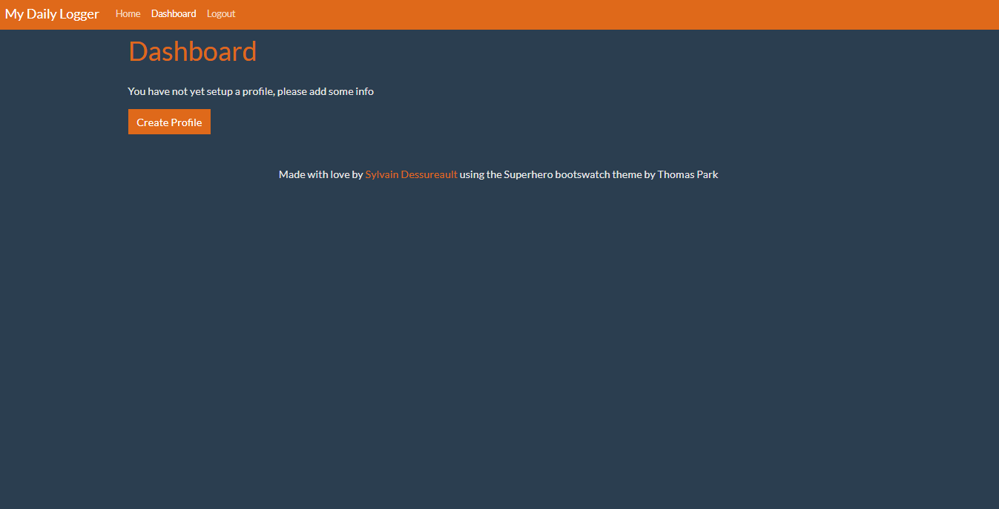
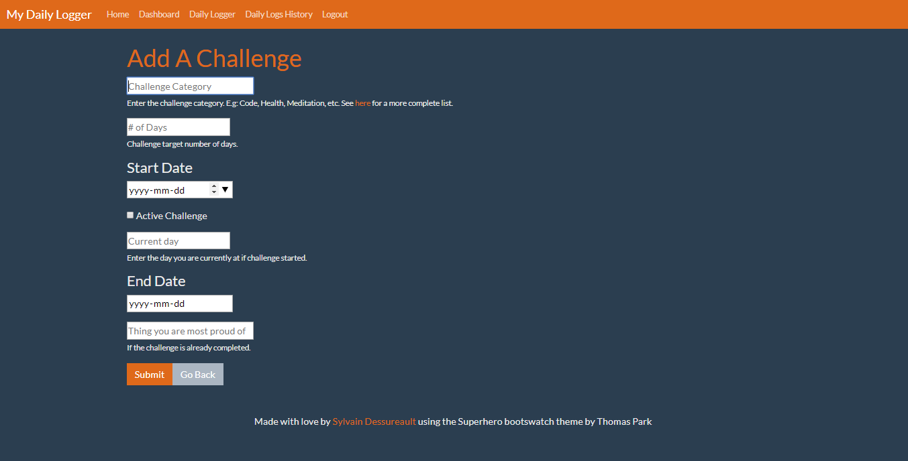
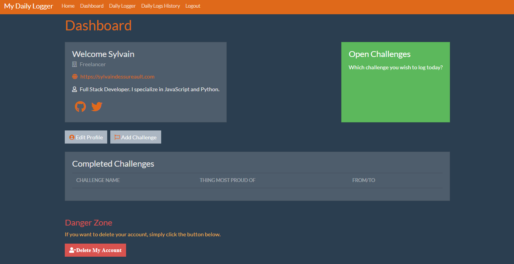

# My Daily Logger

A Daily Log formatter for any XDaysOfX challenge.

## Project Evolution

This project started as a **[simple vanilla JS project](https://github.com/syldess/100daysofcode-daily-logger/)** that I used when I was going through the 100DaysOfCode challenge. After I took [Brad Traversy](https://github.com/bradtraversy)'s [MERN stack course on Udemy](https://www.udemy.com/course/mern-stack-front-to-back/), I decided to migrate the project to a full-blown MERN stack web application.

I originally created this to optimize the daily logs for the challenge. The user can start a timer, start the work on the challenge, enter all the information as challenge progresses and when finished, on the right side of the page, there is a better formatting of the information for both Twitter(text) and Github(markdown) formats.

Thus, with the click of a button, we can then just copy-paste and post on the appropriate platform.

For any contribution request, feel free to send me a message!

## Home Page

## Login / Sign up

If you do not have an account, simply click on signup.

## Main dashboard

This is an example of a dashboard where the user does not have a profile.

### Create a profile

In the dashboard, the user can create a profile with the option to enter social links icons.

The user can also create an open challenge or a completed one.

Here is an example of a dashboard with profile, but no challenges.

Here is an example of a dashboard with profile, with challenges.

### Edit a profile

Still in the dashboard, the user can edit the profile.

## Daily Logger

This is the core purpose of the application, where the user can start a timer, and enter all the daily information as the coding challenge progresses and when finished. On the right side of the page, there are formatting of the information for both Twitter and Github in markdown format. Thus, with the click of a button, we can then just copy-paste and post on the appropriate platform.

### Daily Logging

This is an example of the daily logger in action.

## Daily Log History

The application also stores the daily logs to a database. Hence, the user can track his progress within a single place, and even edit past logs if there was a mistake when logging or simply if there are additions to be made.

